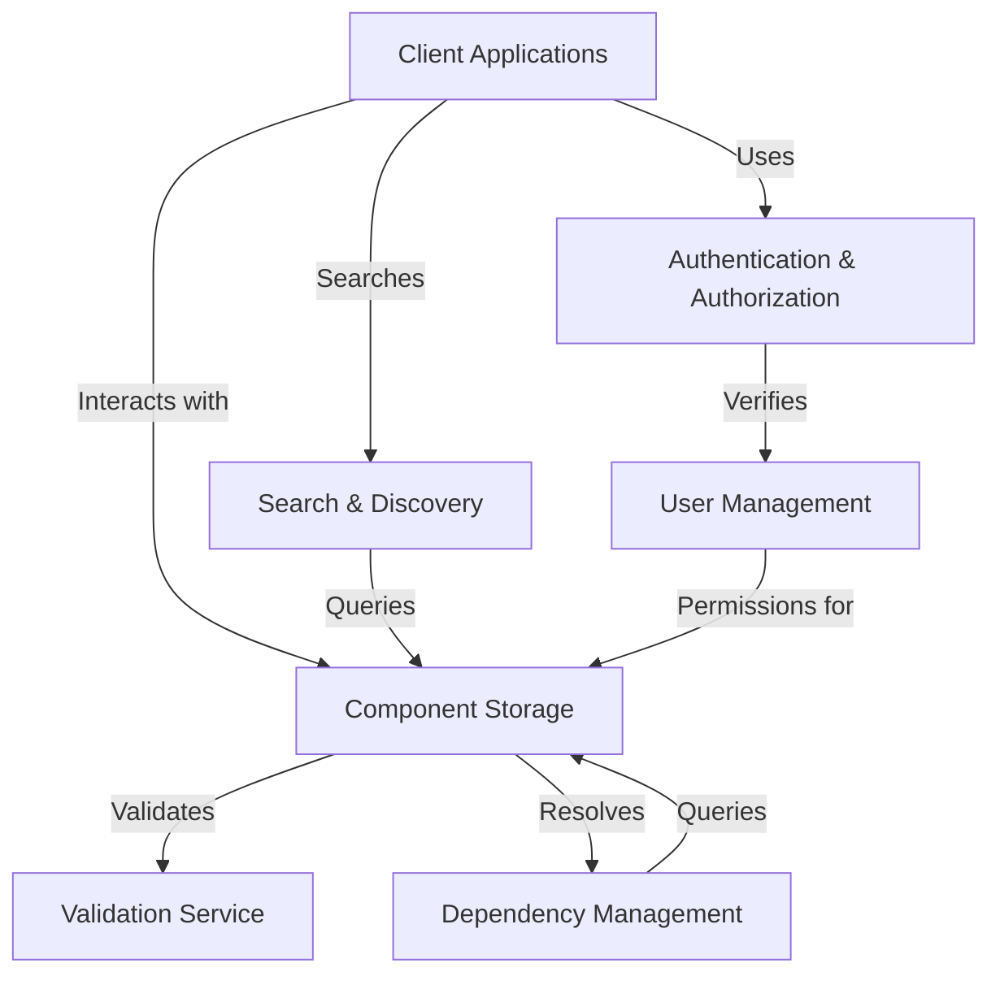

# Specky Repository Components

This directory contains the component specifications for the Specky Repository system. Each component is described in a separate markdown file, structured in a way that can be easily converted to Specky component specifications.

## Component Overview

| Component | Description | File |
|-----------|-------------|------|
| User Management | Handles user accounts, profiles, and activity tracking | [user-management.md](./user-management.md) |
| Component Storage and Retrieval | Manages storage, versioning, and retrieval of component specifications | [component-storage.md](./component-storage.md) |
| Search and Discovery | Enables finding and discovering component specifications | [search-discovery.md](./search-discovery.md) |
| Dependency Management | Handles relationships between component specifications | [dependency-management.md](./dependency-management.md) |
| Authentication and Authorization | Manages user identity verification and access control | [authentication-authorization.md](./authentication-authorization.md) |
| Validation Service | Ensures integrity and correctness of component specifications | [validation-service.md](./validation-service.md) |

## Component Relationships

The components interact with each other to form a complete system:

## Converting to Specky Format

Each component specification is structured to align with the Specky component format:

1. **Overview**: Describes the component's purpose
2. **Core Functionality**: Lists the main capabilities
3. **Features & Use Cases**: Details specific features with business rules
4. **Data Management**: Describes data structures and storage
5. **Integration Points**: Explains how the component interacts with others
6. **Edge Cases and Error Handling**: Covers exceptional situations

To convert these specifications to Specky format:

1. Create a directory for each component
2. Create a `spec.json` file with component metadata
3. Convert the markdown content to `component.md`
4. Extract data models into `datamodel.json` if applicable
5. Create Gherkin feature files in the `tests/` directory based on use cases

## Next Steps

1. Review each component specification for completeness
2. Convert the specifications to Specky format
3. Implement the components using Java and Spring Boot
4. Create a REST API based on the component specifications
5. Integrate the components into a cohesive system