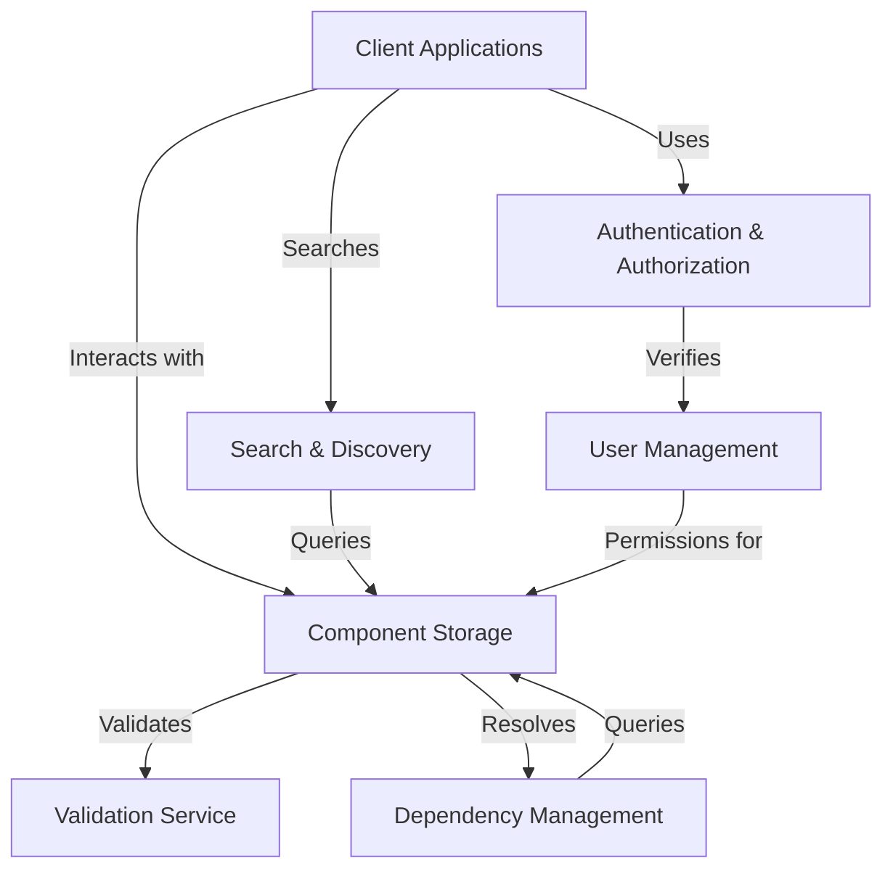

# Specky Repository Components

This directory contains the component specifications for the Specky Repository system. Each component is described in a separate markdown file, structured in a way that can be easily converted to Specky component specifications.

## Component Overview

| Component | Description | File |
|-----------|-------------|------|
| User Management | Handles user accounts, profiles, and activity tracking | [user-management.md](./user-management.md) |
| Component Storage and Retrieval | Manages storage, versioning, and retrieval of component specifications | [component-storage.md](./component-storage.md) |
| Search and Discovery | Enables finding and discovering component specifications | [search-discovery.md](./search-discovery.md) |
| Dependency Management | Handles relationships between component specifications | [dependency-management.md](./dependency-management.md) |
| Authentication and Authorization | Manages user identity verification and access control | [authentication-authorization.md](./authentication-authorization.md) |
| Validation Service | Ensures integrity and correctness of component specifications | [validation-service.md](./validation-service.md) |

## Component Relationships

The components interact with each other to form a complete system:

