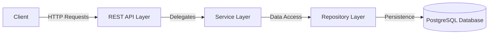
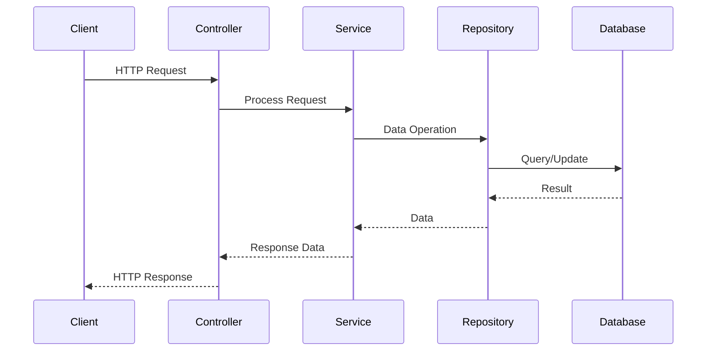
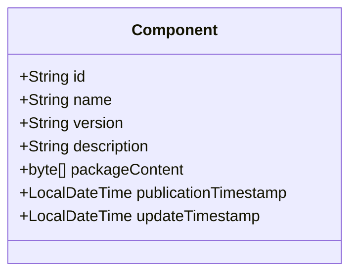
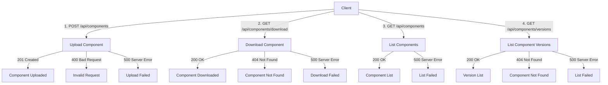
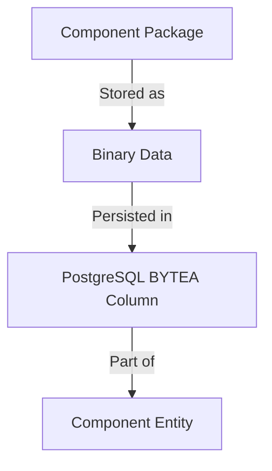
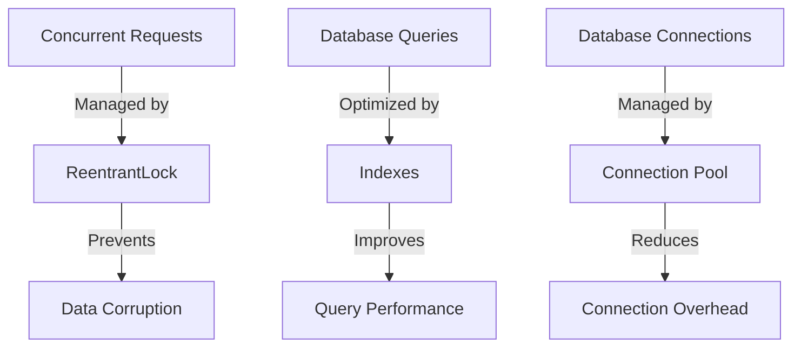
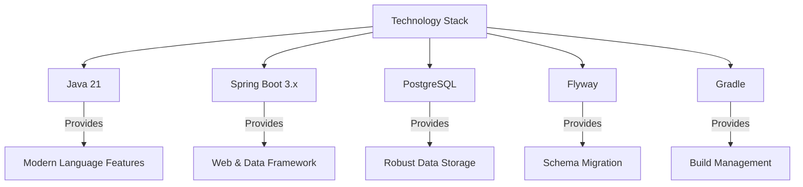
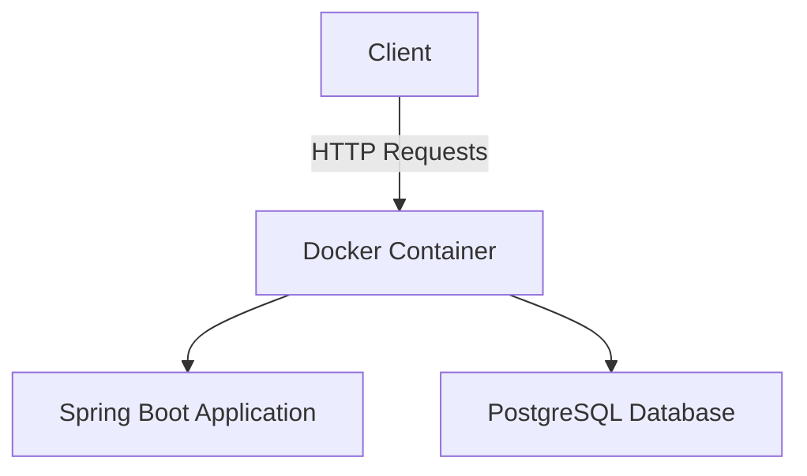
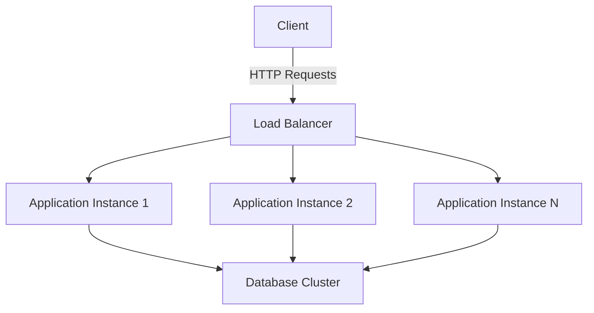

# Specky Repository Architecture Documentation

## 1. System Overview

The Specky Repository is a container for component specifications following the Specky format. It provides a centralized location for storing, retrieving, and managing component packages. The system is designed to be simple, efficient, and easy to use, with a focus on reliability and performance.

### 1.1 Purpose

The primary purpose of the Specky Repository is to:
- Store component specifications in a standardized format
- Provide easy access to component packages
- Support versioning of components
- Enable component discovery and reuse

### 1.2 Scope

The Specky Repository MVP is focused on the core functionality of component storage and retrieval. It includes:
- Component upload and validation
- Component download
- Component listing and version management
- Basic metadata management

## 2. System Architecture

The Specky Repository follows a layered architecture pattern, with clear separation of concerns between different components of the system.

### 2.1 High-Level Architecture



### 2.2 Component Interactions

The system follows a typical request flow:



### 2.3 Key Components

#### 2.3.1 REST API Layer

The REST API layer is responsible for handling HTTP requests and responses. It includes:

- **ComponentController**: Handles component-related operations such as upload, download, and listing
- **Request/Response DTOs**: Data Transfer Objects for API communication
- **Exception Handling**: Global exception handler for consistent error responses

#### 2.3.2 Service Layer

The service layer implements the business logic of the application. It includes:

- **ComponentService**: Manages component operations including validation, storage, and retrieval
- **Business Rules**: Enforces rules such as version management and component validation
- **Transaction Management**: Ensures data consistency during operations

#### 2.3.3 Repository Layer

The repository layer manages data access and persistence. It includes:

- **ComponentRepository**: JPA repository for component entity operations
- **Data Access Logic**: Queries and operations for component data

#### 2.3.4 Database Layer

The database layer stores the component data. It includes:

- **PostgreSQL Database**: Stores component metadata and binary content
- **Schema Design**: Optimized for component storage and retrieval
- **Migrations**: Managed through Flyway for schema evolution

## 3. Data Model

### 3.1 Component Entity

The core entity in the system is the Component, which represents a component specification package:



### 3.2 Database Schema

The database schema is designed to efficiently store and retrieve component packages:

```sql
CREATE TABLE components (
    id VARCHAR(255) PRIMARY KEY,
    name VARCHAR(255) NOT NULL,
    version VARCHAR(255) NOT NULL,
    description TEXT,
    package_content BYTEA NOT NULL,
    publication_timestamp TIMESTAMP NOT NULL,
    update_timestamp TIMESTAMP NOT NULL
);

CREATE INDEX idx_components_name ON components(name);
CREATE INDEX idx_components_name_version ON components(name, version);
```

## 4. API Design

### 4.1 RESTful Endpoints

The API follows RESTful principles with the following endpoints:

| Method | Endpoint                      | Description                           |
|--------|-------------------------------|---------------------------------------|
| POST   | /api/components               | Upload a component                    |
| GET    | /api/components/download      | Download a specific component version |
| GET    | /api/components               | List all components                   |
| GET    | /api/components/versions      | List versions of a specific component |

### 4.2 Request/Response Flow



## 5. Storage Strategy

### 5.1 Binary Storage

Component packages (ZIP files) are stored directly in the database as binary data (BYTEA type in PostgreSQL). This approach was chosen for the MVP for simplicity and ease of implementation.



### 5.2 Considerations

- **Advantages**:
  - Simplified architecture (no separate file storage system)
  - Transactional consistency with metadata
  - Easier backup and recovery

- **Limitations**:
  - Database size growth with large packages
  - Potential performance impact with many large packages

### 5.3 Future Enhancements

For future versions, alternative storage strategies could be considered:
- File system storage with database metadata
- Object storage (S3, etc.) for larger scale deployments

## 6. Security Considerations

### 6.1 Current Implementation

The MVP focuses on core functionality and includes basic security measures:
- Input validation for all API endpoints
- Error handling to prevent information leakage
- Transaction isolation to prevent data corruption

### 6.2 Future Enhancements

Future versions should consider additional security measures:
- Authentication and authorization
- Rate limiting
- Package signature verification
- Vulnerability scanning for uploaded packages

## 7. Performance Considerations

### 7.1 Current Implementation

The MVP includes basic performance optimizations:
- Database indexing for efficient queries
- Connection pooling for database access
- Concurrent operation handling with locks



### 7.2 Future Enhancements

Future versions should consider additional performance optimizations:
- Caching frequently accessed components
- Pagination for large result sets
- Asynchronous processing for large uploads
- Content delivery network (CDN) integration for downloads

## 8. Design Decisions and Rationale

### 8.1 Technology Stack



### 8.2 Key Design Decisions

#### 8.2.1 Database Storage for Binary Data

**Decision**: Store component packages directly in the database.

**Rationale**:
- Simplifies the architecture by eliminating the need for a separate file storage system
- Ensures transactional consistency between metadata and binary data
- Suitable for the expected small to medium size of component packages
- Simplifies backup and recovery processes

#### 8.2.2 REST API Design

**Decision**: Implement a RESTful API with clear endpoint semantics.

**Rationale**:
- Follows industry best practices for API design
- Provides a clear and intuitive interface for clients
- Enables easy integration with various client technologies
- Supports future extension with additional endpoints

#### 8.2.3 Versioning Strategy

**Decision**: Use semantic versioning for components.

**Rationale**:
- Industry standard for version management
- Provides clear rules for version compatibility
- Enables automated tools to understand version relationships
- Familiar to developers and users

## 9. Deployment Architecture

### 9.1 Current Deployment

The MVP is designed for simple deployment:



### 9.2 Future Deployment Options

Future versions could consider more complex deployment architectures:



## 10. Monitoring and Observability

### 10.1 Current Implementation

The MVP includes basic logging and monitoring:
- Comprehensive logging of operations
- Error tracking and reporting

### 10.2 Future Enhancements

Future versions should consider additional monitoring capabilities:
- Metrics collection and dashboards
- Distributed tracing
- Alerting and notification
- Health checks and self-healing

## 11. Conclusion

The Specky Repository MVP provides a solid foundation for component storage and retrieval. The architecture is designed to be simple yet extensible, allowing for future enhancements as requirements evolve. The system prioritizes reliability, data integrity, and ease of use, making it suitable for its intended purpose as a component specification repository.