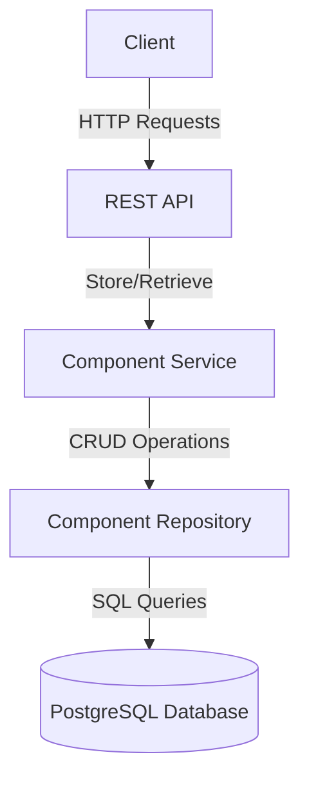

# Specky Repository Implementation Plan

## System Architecture Overview

The Specky Repository MVP will be a simple system focused on storing and retrieving component specifications. Here's the architecture overview:



### Technology Stack
- **Programming Language**: Java 21
- **Framework**: Spring Boot 3.x with WebMVC and DataJPA
- **Database**: PostgreSQL 17
- **Build Tool**: Maven or Gradle
- **Packaging**: Docker
- **Testing**: JUnit 5, Cucumber for BDD tests

### Key Components
1. **REST API Layer**: Handles HTTP requests for component upload and download
2. **Service Layer**: Implements business logic for component management
3. **Repository Layer**: Manages database operations including storing and retrieving component packages

## Step-by-Step Implementation Plan

### 1. Project Setup and Configuration
- [ ] Initialize Spring Boot project with required dependencies
  - Spring Web
  - Spring Data JPA
  - PostgreSQL Driver
  - Lombok (optional, for reducing boilerplate)
  - Validation API
- [ ] Configure application properties (database connection, etc.)
- [ ] Set up project structure (controllers, services, repositories, models, etc.)

### 2. Database Setup
- [x] Create database schema
- [x] Configure JPA entities
- [x] Set up database migration scripts (using Flyway or Liquibase)
- [x] Configure database to handle binary data efficiently

### 3. Core Domain Model Implementation
- [ ] Implement Component entity based on the data model
  ```java
  @Entity
  public class Component {
      @Id
      private String id; // Format: @specky/component-storage@1.2.3
      private String name;
      private String version;
      private String description;
      @Lob
      private byte[] packageContent; // Store ZIP file directly in DB
      private LocalDateTime publicationTimestamp;
      private LocalDateTime updateTimestamp;
  }
  ```
- [ ] Implement validation for semantic versioning
- [ ] Create repository interface for Component entity

### 4. Component Service Implementation
- [ ] Implement service for component management
  - Component upload and validation
  - Component retrieval
  - Component metadata extraction
  - Version management
- [ ] Implement error handling and edge cases
  - Large package handling
  - Version conflict resolution
  - Concurrent operations management
  - Corrupted package detection

### 5. REST API Implementation
- [ ] Design RESTful API endpoints
  - POST /api/components - Upload a component
  - GET /api/components/{name}/{version} - Download a specific component version
  - GET /api/components - List available components
  - GET /api/components/{name} - List available versions of a component
- [ ] Implement controllers for the API endpoints
- [ ] Implement request/response DTOs
- [ ] Implement error handling and response status codes

### 6. Testing
- [ ] Implement unit tests for all components
- [ ] Implement integration tests for API endpoints
- [ ] Implement BDD tests using Cucumber based on the provided feature files
  - Component publishing tests
  - Component retrieval tests
- [ ] Perform load testing for concurrent operations
- [ ] Test database performance with various component package sizes

### 7. Documentation
- [ ] Create API documentation using Swagger/OpenAPI
- [ ] Document system architecture and design decisions
- [ ] Create user guide for component publishing and retrieval

### 8. Packaging and Deployment
- [ ] Create Dockerfile for containerization
- [ ] Configure Docker Compose for local development
- [ ] Create deployment scripts for cloud environments
- [ ] Set up CI/CD pipeline (optional)

### 9. Final Testing and Validation
- [ ] Perform end-to-end testing
- [ ] Validate against all requirements and use cases
- [ ] Fix any identified issues

## Implementation Details

### Component Entity Structure
Based on the provided data model, the Component entity will have the following structure:
- id: Unique identifier (e.g., '@specky/component-storage@1.2.3')
- name: Component name (e.g., '@specky/component-storage')
- version: Component version following semantic versioning
- description: Component description
- packageContent: Binary data of the component package (ZIP file)
- publicationTimestamp: When the component was published
- updateTimestamp: When the component was last updated

### API Endpoints

#### Upload Component
- **Endpoint**: POST /api/components
- **Request**: Multipart form with component package file
- **Response**: 
  - 201 Created - Component successfully uploaded
  - 400 Bad Request - Invalid component package
  - 500 Internal Server Error - Upload failed

#### Download Component
- **Endpoint**: GET /api/components/{name}/{version}
- **Response**: 
  - 200 OK - Component package as ZIP file
  - 404 Not Found - Component not found
  - 500 Internal Server Error - Download failed

#### List Components
- **Endpoint**: GET /api/components
- **Response**: 
  - 200 OK - List of available components with metadata
  - 500 Internal Server Error - Retrieval failed

#### List Component Versions
- **Endpoint**: GET /api/components/{name}
- **Response**: 
  - 200 OK - List of available versions for the component
  - 404 Not Found - Component not found
  - 500 Internal Server Error - Retrieval failed

### Storage Strategy
For the MVP, we'll store component packages directly in the database:
1. Component packages (ZIP files) will be stored as binary data in the database
2. The packageContent field in the Component entity will use the @Lob annotation to store large binary objects
3. This approach simplifies the architecture by eliminating the need for a separate file storage system
4. Since the component packages are expected to be small, this approach is efficient and simplifies data management

### Database Considerations
- Configure the database with appropriate settings for binary data storage
- Monitor database performance and size as the number of components grows
- Consider implementing a size limit for component packages to prevent database issues
- Ensure proper indexing for efficient retrieval by name and version