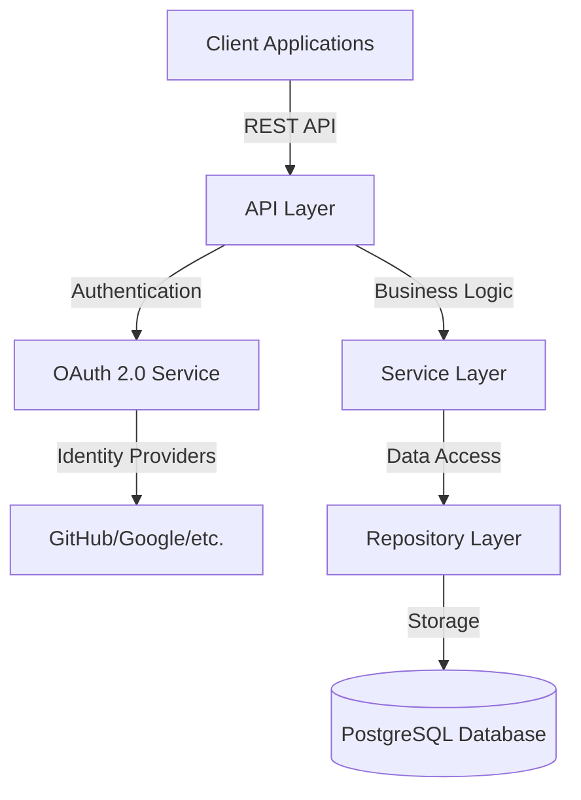
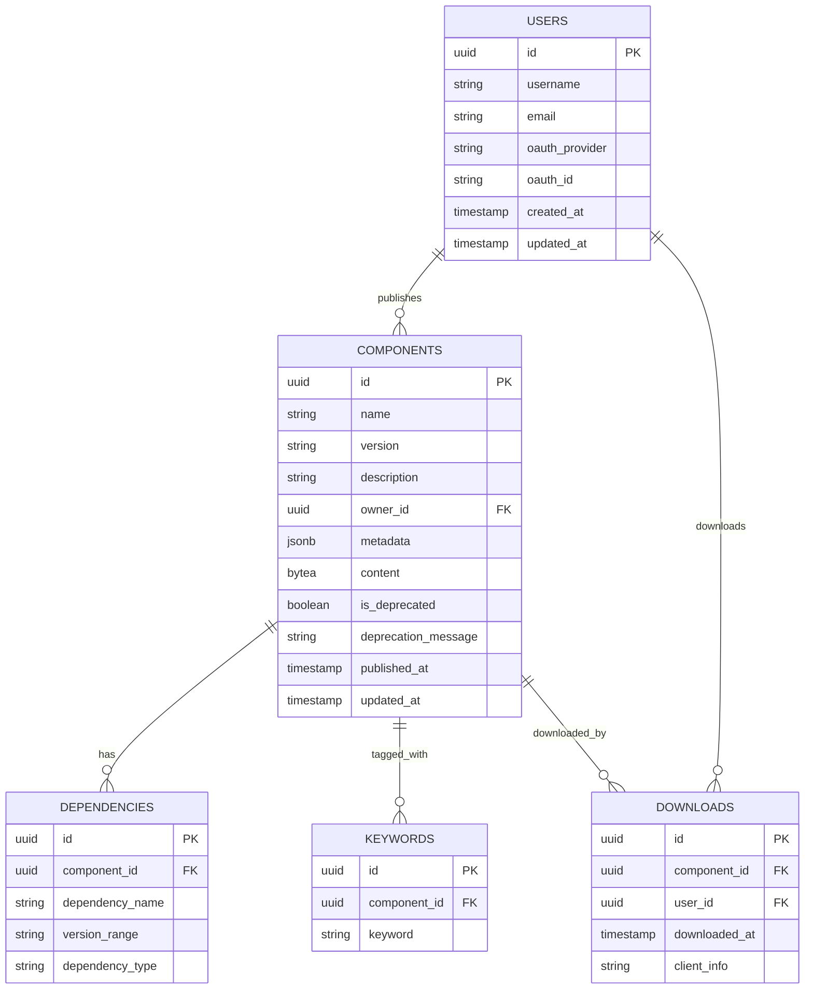

# Specky Repository Implementation Plan

## 1. System Architecture



### Key Components:

1. **API Layer**: REST endpoints for all repository operations
2. **Authentication Service**: OAuth 2.0 integration with multiple identity providers
3. **Service Layer**: Business logic for component management
4. **Repository Layer**: Data access and storage operations
5. **PostgreSQL Database**: Storage for both metadata and zip files

## 2. Database Design



### Tables:

1. **USERS**: Store user information and OAuth credentials
2. **COMPONENTS**: Store component metadata and the actual zip content
3. **DEPENDENCIES**: Track dependencies between components
4. **KEYWORDS**: Store searchable keywords/tags for components
5. **DOWNLOADS**: Track download statistics

## 3. API Endpoints

### Authentication

- `POST /api/auth/login`: Initiate OAuth flow
- `GET /api/auth/callback`: OAuth callback handler
- `POST /api/auth/logout`: End user session
- `GET /api/auth/user`: Get current user info

### Component Management

- `POST /api/components`: Publish a new component
- `GET /api/components`: Search/list components
- `GET /api/components/{name}`: Get component info
- `GET /api/components/{name}/{version}`: Get specific version
- `DELETE /api/components/{name}/{version}`: Unpublish a version
- `PUT /api/components/{name}/deprecate`: Deprecate a component
- `GET /api/components/{name}/versions`: List all versions
- `GET /api/components/{name}/dependencies`: List dependencies
- `GET /api/components/{name}/dependents`: List components that depend on this

### Package Operations

- `GET /api/download/{name}/{version}`: Download a component
- `GET /api/validate/{name}/{version}`: Validate a component

### User Management

- `GET /api/users/{username}/components`: List user's components
- `GET /api/users/me/downloads`: List user's download history

## 4. Core Services Implementation

### 1. Component Service

```java
@Service
public class ComponentService {
    // Publish a new component
    public Component publish(MultipartFile zipFile, String username);
    
    // Get component by name and version
    public Component getComponent(String name, String version);
    
    // Search components by criteria
    public Page<Component> searchComponents(SearchCriteria criteria, Pageable pageable);
    
    // Deprecate a component
    public Component deprecateComponent(String name, String message);
    
    // Validate a component against schema
    public ValidationResult validateComponent(String name, String version);
    
    // Download a component
    public byte[] downloadComponent(String name, String version, String username);
    
    // Unpublish a component
    public void unpublishComponent(String name, String version, String username);
}
```

### 2. User Service

```java
@Service
public class UserService {
    // Get user by username
    public User getUserByUsername(String username);
    
    // Create or update user from OAuth data
    public User processOAuthUser(OAuthUserInfo userInfo);
    
    // Get user's published components
    public Page<Component> getUserComponents(String username, Pageable pageable);
    
    // Get user's download history
    public Page<Download> getUserDownloads(String username, Pageable pageable);
}
```

### 3. Dependency Service

```java
@Service
public class DependencyService {
    // Resolve dependencies for a component
    public List<Component> resolveDependencies(String name, String version);
    
    // Find components that depend on a specific component
    public List<Component> findDependents(String name, String version);
    
    // Check for circular dependencies
    public boolean hasCircularDependencies(String name, String version);
}
```

## 5. Implementation Phases

### Phase 1: Core Infrastructure

1. Set up Spring Boot project with required dependencies
2. Configure PostgreSQL and connection pooling
3. Implement database schema and migrations
4. Set up OAuth 2.0 authentication with Spring Security
5. Create basic API structure and error handling

### Phase 2: Component Management

1. Implement component upload/publish functionality
2. Develop component storage in PostgreSQL
3. Implement component retrieval and download
4. Create component validation against schema
5. Implement basic search functionality

### Phase 3: User and Dependency Management

1. Implement user profile management
2. Develop dependency resolution logic
3. Implement version management with semantic versioning
4. Create statistics tracking for downloads
5. Implement user permissions and access control

### Phase 4: Advanced Features

1. Implement component deprecation and unpublishing
2. Add webhook support for notifications
3. Implement rate limiting and API security
4. Create admin dashboard for repository management
5. Develop comprehensive API documentation

## 6. Technical Stack

### Backend
- **Framework**: Spring Boot 3.x
- **Language**: Java 17+
- **Database**: PostgreSQL 14+
- **Authentication**: Spring Security with OAuth 2.0
- **API Documentation**: SpringDoc OpenAPI (Swagger)
- **Testing**: JUnit 5, Mockito, Testcontainers
- **Build Tool**: Maven or Gradle

### Infrastructure
- **Containerization**: Docker
- **CI/CD**: GitHub Actions or Jenkins
- **Monitoring**: Spring Actuator, Prometheus, Grafana
- **Logging**: SLF4J, Logback, ELK Stack

## 7. Security Considerations

1. **Authentication**: OAuth 2.0 with JWT tokens
2. **Authorization**: Role-based access control (RBAC)
3. **Data Protection**: 
   - Validate and sanitize all user inputs
   - Implement HTTPS for all communications
   - Encrypt sensitive data in the database
4. **Rate Limiting**: Prevent abuse with API rate limiting
5. **Audit Logging**: Track all security-relevant events

## 8. Scalability Considerations

1. **Database Scaling**:
   - Connection pooling
   - Indexing for efficient searches
   - Consider read replicas for high-traffic scenarios
   
2. **Application Scaling**:
   - Stateless design for horizontal scaling
   - Caching frequently accessed components
   - Consider CDN integration for downloads

## 9. Monitoring and Maintenance

1. **Health Checks**: Implement Spring Actuator endpoints
2. **Metrics Collection**: Track API usage, response times, error rates
3. **Alerting**: Set up alerts for system issues
4. **Backup Strategy**: Regular database backups
5. **Disaster Recovery Plan**: Define procedures for data recovery

## 10. Future Enhancements

1. **Advanced Search**: Full-text search across all component files
2. **Vulnerability Scanning**: Check components for security issues
3. **Analytics Dashboard**: Provide insights on component usage
4. **Private Repositories**: Support for private component hosting
5. **Webhooks**: Event notifications for component lifecycle events